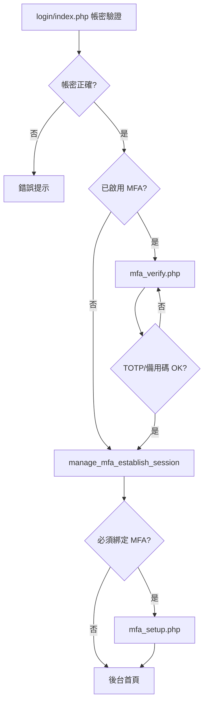

# 後台 TOTP 雙因素驗證 — 新專案移植指南

> 本文件說明 brick6 後台 TOTP（RFC 6238）雙因素驗證的 **SQL migration、檔案清單、逐檔整合 patch 摘要** 與部署流程。  
> 適用於從 brick6 複製到新專案，或在新站從零整合。  
> 相關：`docs/DEVELOPER-ONBOARDING-GUIDE.md`

---

## 目錄

1. [功能概覽](#1-功能概覽)
2. [架構與 Session 狀態](#2-架構與-session-狀態)
3. [Migration（可複製 SQL）](#3-migration可複製-sql)
4. [環境變數](#4-環境變數)
5. [檔案清單](#5-檔案清單)
6. [逐檔整合 Patch 摘要](#6-逐檔整合-patch-摘要)
7. [使用者流程](#7-使用者流程)
8. [部署 Checklist](#8-部署-checklist)
9. [測試 Checklist](#9-測試-checklist)
10. [MVP 與完整版](#10-mvp-與完整版)
11. [疑難排解](#11-疑難排解)

---

## 1. 功能概覽

| 功能 | 說明 |
|------|------|
| **登入第二關** | 密碼正確且帳號已綁 TOTP → 導向 `mfa_verify.php` 輸入 6 位數或備用碼 |
| **首次綁定** | 登入後若未綁定（或全站強制）→ 導向 `mfa_setup.php` 掃 QR |
| **備用碼** | 綁定時產生 8 組一次性備用碼（bcrypt hash 存 DB） |
| **重新綁定／停用** | 需現有密碼 + TOTP／備用碼 |
| **Onboarding 信** | 新增帳號時寄綁定指引（可選） |
| **重發指引信** | 編輯既有帳號可重發（可選） |

**技術選型：**

- 自建 TOTP（Base32 + HMAC-SHA1，30 秒週期），**無** Composer OTP 套件
- Secret 以 `Authcode()` + `APP_SECRET_KEY` 加密存入 `webcontrol.totp_secret`
- QR Code 使用外部 API：`api.qrserver.com`（`mfa_setup.php` 需能連外，或自行改成本機產 QR）
- 寄信一律經 `SendMail()` → `.env` 的 `MAIL_API_URL`（禁止本機 SMTP）

---

## 2. 架構與 Session 狀態

### 2.1 登入狀態機



### 2.2 Session 欄位

**MFA Pending（第二關，尚未正式登入）：**

| Session 鍵 | 說明 |
|------------|------|
| `MFA_Pending` | `true` |
| `MFA_User_PKey` | 使用者 PKey |
| `MFA_strID` / `MFA_UserName` / `MFA_FunctionID` | 待寫入正式 Session 的資料 |
| `MFA_Started` | 開始時間（預設 600 秒逾時） |
| `MFA_Attempts` | 驗證失敗次數（≥5 鎖定） |

此階段 **未** 設定 `Manage=Yes`。`manage/_inc.php` 會攔截所有後台頁，只允許 `mfa_verify.php`。

**正式登入後：**

| Session 鍵 | 說明 |
|------------|------|
| `Manage` | `'Yes'` |
| `Login_ID` / `UserName` / `FunctionID` / `Login_PKey` | 一般後台 Session |

若 `MANAGE_MFA_REQUIRED=1` 且帳號未綁定 → `_inc.php` 強制導向 `mfa_setup.php`。

### 2.3 資料表欄位（`webcontrol`）

| 欄位 | 型別 | 說明 |
|------|------|------|
| `strEmail` | VARCHAR(100) | 管理者 Email（onboarding 用） |
| `mfa_enabled` | TINYINT(1) | 是否啟用 TOTP |
| `totp_secret` | VARCHAR(512) | 加密後 secret |
| `mfa_backup_codes` | TEXT | 備用碼 hash JSON |
| `mfa_setup_pending` | TINYINT(1) | 待完成首次綁定 |

---

## 3. Migration（可複製 SQL）

各環境**手動執行一次**。若欄位已存在，請略過或改寫 migration。

### 3.1 核心 TOTP 欄位

檔案：`sql/webcontrol_totp_mfa.sql`

```sql
-- 後台 webcontrol TOTP 多因素驗證欄位
-- 各環境手動執行一次

ALTER TABLE webcontrol
    ADD COLUMN mfa_enabled TINYINT(1) NOT NULL DEFAULT 0 COMMENT '是否啟用 TOTP' AFTER strPW,
    ADD COLUMN totp_secret VARCHAR(512) NOT NULL DEFAULT '' COMMENT '加密後 TOTP secret' AFTER mfa_enabled,
    ADD COLUMN mfa_backup_codes TEXT NULL COMMENT '備用碼 hash JSON' AFTER totp_secret;
```

### 3.2 Onboarding（Email + 待綁定旗標）

檔案：`sql/webcontrol_mfa_onboard.sql`  
（需先執行 3.1）

```sql
-- 後台帳號 MFA onboarding：Email、首次登入強制綁定旗標
-- 若已執行 webcontrol_totp_mfa.sql，本檔為增量 migration

ALTER TABLE webcontrol
    ADD COLUMN strEmail VARCHAR(100) NOT NULL DEFAULT '' COMMENT '管理者 Email（MFA 指引信）' AFTER strName,
    ADD COLUMN mfa_setup_pending TINYINT(1) NOT NULL DEFAULT 0 COMMENT '待完成首次 MFA 綁定' AFTER mfa_backup_codes;
```

---

## 4. 環境變數

同步更新 `.env.example`（勿提交 `.env`）。

```env
# 必填：加密 totp_secret
APP_SECRET_KEY=change_me_to_random_string

# 本機開發（影響 MAIL API SSL 預設行為）
APP_ENV=local

# 寄 MFA 指引信
MAIL_API_URL="https://your-mail-api.example/mail.php"
# 本機自簽憑證可設 0；未設時 APP_ENV=local 自動略過 SSL 驗證
# MAIL_API_SSL_VERIFY=0

# 1 = 全站強制綁定（未綁定無法使用後台）
MANAGE_MFA_REQUIRED=0

# 1 = 新增帳號時寄 MFA 綁定指引信
MANAGE_MFA_ONBOARD_EMAIL=1
```

**其他依賴：**

- `webset.FromMail`（或 `$GLOBALS['Web_Mail']`）作為寄件人
- `PASSWORD_PEPPER`（登入密碼驗證，與 MFA 無直接關係但登入流程共用）

---

## 5. 檔案清單

### 5.1 新增檔案（整檔複製）

| 優先 | 路徑 | 說明 |
|:----:|------|------|
| ★ | `sql/webcontrol_totp_mfa.sql` | DB migration |
| ★ | `include/mfa_helpers.php` | TOTP 核心邏輯（約 700 行） |
| ★ | `manage/login/mfa_verify.php` | 登入第二關 |
| ★ | `manage/control/mfa_setup.php` | 綁定／重綁／停用 |
| ○ | `sql/webcontrol_mfa_onboard.sql` | Email onboarding migration |
| ○ | `manage/control/mfa_resend_mail.php` | 重發指引信 POST 處理 |

★ = MVP 必要　○ = onboarding 可選

### 5.2 修改既有檔案

| 優先 | 路徑 | 說明 |
|:----:|------|------|
| ★ | `manage/_inc.php` | require helper、pending 攔截、強制 setup |
| ★ | `manage/login/index.php` | 密碼成功後 MFA 分支 |
| ★ | `manage/_sidebar.php` | 選單「雙因素驗證」 |
| ★ | `.env.example` | MFA 環境變數 |
| ○ | `manage/control/_form_data.php` | Email 欄位、驗證、寫入 |
| ○ | `manage/control/_detail.php` | Email 表單、重發信區塊 |
| ○ | `manage/control/addin.php` | 新增帳號寄信 |
| ○ | `include/Function.php` | `SendMail` SSL + 回應判斷 |
| ○ | `manage/js/manage-csp.js` | `data-manage-confirm` 表單確認 |

---

## 6. 逐檔整合 Patch 摘要

以下以「相對於未整合 MFA 的 brick6 基底」描述變更。新專案可依序套用。

---

### 6.1 `manage/_inc.php`（★ 必改）

**位置 A — require（約第 21 行，`Function.php` 之後）：**

```diff
 require_once dirname(dirname(__FILE__)).'/include/Function.php';//引入文件
+require_once dirname(dirname(__FILE__)).'/include/mfa_helpers.php';//TOTP 多因素驗證
 require_once dirname(dirname(__FILE__)).'/include/log.php';//引入文件
```

**位置 B — 登入檢查前（權限載入後、Session 驗證前，約第 381 行）：**

```diff
+$__manageSelf = (string)($_SERVER['PHP_SELF'] ?? '');
+$__mfaPending = function_exists('manage_mfa_pending_valid') && manage_mfa_pending_valid();
+$__isLoginIndex = stripos($__manageSelf, '/login/index.php') !== false;
+$__isMfaVerify = stripos($__manageSelf, '/login/mfa_verify.php') !== false;
+
+if ($__mfaPending && !$__isMfaVerify && !$__isLoginIndex) {
+    if (!stristr($WorkFile ?? '', 'index.php')) {
+        if (!empty($manage_binary_export)) {
+            require_once dirname(dirname(__FILE__)) . '/include/json_response.php';
+            json_out(['success' => false, 'error' => '請先完成雙因素驗證'], 401);
+        }
+        location_href($web_root . 'manage/login/mfa_verify.php');
+        exit;
+    }
+}
+
 if((isset($_SESSION['Manage']) and $_SESSION['Manage'] != 'Yes') || empty($_SESSION['Login_ID'])){
-    if(! stristr($WorkFile ?? '', 'index.php')) {
+    if(! stristr($WorkFile ?? '', 'index.php') && !($__isMfaVerify && $__mfaPending)) {
         ...
     }
 }
+
+if (function_exists('manage_mfa_redirect_setup_if_needed')) {
+    manage_mfa_redirect_setup_if_needed();
+}
```

**摘要：** 載入 helper；MFA pending 時只允許驗證頁；未綁定且全站強制時導向 setup。

---

### 6.2 `manage/login/index.php`（★ 必改）

**位置 A — 頁首（登出後、已登入檢查前，約第 27 行）：**

```diff
+if (function_exists('manage_mfa_pending_valid') && manage_mfa_pending_valid()) {
+    location_href($web_root . 'manage/login/mfa_verify.php');
+    exit;
+}
```

**位置 B — 密碼驗證成功區塊（約第 163 行，`else {` 成功分支）：**

```diff
         else {
+            $userRow = [
+                'PKey'       => $PKey,
+                'strID'      => (string)$rs->field('strID'),
+                'strName'    => (string)$rs->field('strName'),
+                'FunctionID' => (string)$rs->field('FunctionID'),
+                'mfa_enabled' => 0,
+                'totp_secret' => '',
+            ];
+            if (function_exists('manage_mfa_schema_ready') && manage_mfa_schema_ready()) {
+                $userRow['mfa_enabled'] = (int)$rs->field('mfa_enabled');
+                $userRow['totp_secret'] = (string)$rs->field('totp_secret');
+            }
+
             // 清除錯誤與解除鎖定
             ...

+            if (function_exists('manage_mfa_schema_ready')
+                && manage_mfa_schema_ready()
+                && manage_mfa_is_enabled_for_user($userRow)) {
+                manage_mfa_begin_pending_login($userRow);
+                manage_history(3, $Module_Name, '密碼驗證成功，待 TOTP', $WorkFile, $strID, '待雙因素驗證');
+                location_href($web_root . 'manage/login/mfa_verify.php');
+                exit;
+            }
+
+            manage_mfa_establish_session($userRow);
+
             $show = '登入成功';
             manage_history(3, $Module_Name, '登入成功', $WorkFile, $strID, $show);
-
-            location_href($web_root . 'manage/login/login.php');
+            location_href(manage_mfa_post_login_url(manage_mfa_fetch_user_by_login($strID)));
             exit;
         }
```

**摘要：** 密碼 OK → 已綁 MFA 則 pending + 導向 verify；否則直接 Session + 依設定導向 setup 或首頁。

---

### 6.3 `manage/_sidebar.php`（★ 必改）

**位置 — 帳號管理子選單（`chgpw.php` 附近）：**

```diff
                 $menu[] = [
                     'type'     => 'LINK',
                     'label'    => '變更密碼',
                     'link'     => '../control/chgpw.php',
                     'isActive' => $subitem === 's5',
                 ];
+                $menu[] = [
+                    'type'     => 'LINK',
+                    'label'    => '雙因素驗證',
+                    'link'     => '../control/mfa_setup.php',
+                    'isActive' => $subitem === 's6',
+                ];
```

**摘要：** 新增側欄入口；`mfa_setup.php` 使用 `$subitem = 's6'`。

---

### 6.4 `.env.example`（★ 必改）

```diff
 MAIL_API_URL="https://your-mail-api.example/mail.php"
+# MAIL API SSL：0=略過（本機自簽）；或 CA 路徑；未設時 APP_ENV=local 自動略過
+# MAIL_API_SSL_VERIFY=0
 ...
+# 後台登入強制啟用 TOTP（1 啟用；管理者須至「雙因素驗證」完成綁定）
+MANAGE_MFA_REQUIRED=0
+# 新增後台帳號時寄送 MFA 綁定指引信（需 strEmail 與 MAIL_API_URL、webset FromMail）
+MANAGE_MFA_ONBOARD_EMAIL=1
```

---

### 6.5 `include/mfa_helpers.php`（★ 新增，整檔複製）

**摘要 — 主要函式對照：**

| 函式 | 用途 |
|------|------|
| `manage_mfa_schema_ready()` | 偵測 migration 3.1 是否已執行 |
| `manage_mfa_onboard_schema_ready()` | 偵測 migration 3.2 是否已執行 |
| `manage_mfa_generate_secret()` / `manage_mfa_verify_totp()` | TOTP 演算法 |
| `manage_mfa_encrypt_secret()` / `manage_mfa_decrypt_secret()` | 依 `Authcode` + `APP_SECRET_KEY` |
| `manage_mfa_begin_pending_login()` / `manage_mfa_complete_login()` | Session 狀態 |
| `manage_mfa_verify_for_user()` | TOTP 或備用碼 |
| `manage_mfa_save_enabled()` / `manage_mfa_disable()` | 寫入 DB |
| `manage_mfa_redirect_setup_if_needed()` | 全站強制綁定攔截 |
| `manage_mfa_send_onboard_email()` | 寄 onboarding 信 |
| `manage_mfa_resend_onboard_mail()` | 重發指引信 |

**外部依賴：** `Authcode()`、`crud_table_has_column()`、`crud_fetch_one()`、`dbPDO`、`SendMail()`、`CheckMail()`、`manage_history()`。

---

### 6.6 `manage/login/mfa_verify.php`（★ 新增，整檔複製）

**摘要：**

- 僅在 `manage_mfa_pending_valid()` 為 true 時可存取
- POST `Submit=送出` → `manage_mfa_verify_for_user()` → `manage_mfa_complete_login()` → 導向 `manage_mfa_post_login_url()`
- POST `Action=cancel` → 清除 pending、`session_destroy()`、回登入頁
- 失敗 ≥5 次鎖定
- 表單使用 `data-manage-validate` + CSP nonce 內嵌 JS（`script_open()`）

---

### 6.7 `manage/control/mfa_setup.php`（★ 新增，整檔複製）

**摘要：**

- 需已登入（`$_SESSION['Login_ID']`）
- 動作：`開始設定` → 產生 secret + QR → `確認啟用` → 顯示備用碼
- `開始重新綁定` / `確認重新綁定`：需密碼 + 現有 TOTP
- `停用`：需密碼 + TOTP
- Session 暫存：`MFA_Setup_Secret`、`MFA_Setup_PKey`、`MFA_Setup_Mode`
- QR 外連 `api.qrserver.com`（CSP `img-src` 需允許，或改本機 QR）

---

### 6.8 `manage/control/_form_data.php`（○ onboarding）

**位置 A — `control_detail_defaults()`：**

```diff
             'strName'     => '',
+            'strEmail'    => '',
             'strPW'       => '',
```

**位置 B — `control_detail_load()` 載入列：**

```diff
             'strName'     => (string)($row['strName'] ?? ''),
+            'strEmail'    => (string)($row['strEmail'] ?? ''),
```

**位置 C — `control_validate_form()` 新增帳號 Email 驗證：**

```diff
+        $strEmail = trim((string)($filter['strEmail'] ?? ''));
+        if ($strEmail !== '' && function_exists('CheckMail') && !CheckMail($strEmail)) {
+            $msg .= "【Email】格式錯誤\n";
+        }
+        if ($isNew
+            && function_exists('manage_mfa_onboard_email_enabled')
+            && manage_mfa_onboard_email_enabled()
+            && function_exists('manage_mfa_onboard_schema_ready')
+            && manage_mfa_onboard_schema_ready()
+            && $strEmail === '') {
+            $msg .= "【Email】新增帳號請填寫，以便寄送 MFA 綁定指引信\n";
+        }
```

**位置 D — `control_build_master_data()`：**

```diff
+        if (function_exists('manage_mfa_onboard_schema_ready') && manage_mfa_onboard_schema_ready()) {
+            $data['strEmail'] = SqlFilter(trim((string)($filter['strEmail'] ?? '')), 'tab');
+        }
```

---

### 6.9 `manage/control/_detail.php`（○ onboarding）

**位置 A — JS 驗證 `fieldCheck0()`：新增 Email 檢查（約第 68 行）**

```diff
+  if (isNew) {
+    if ($('#strEmail').length && $.trim($('#strEmail').val()) === '') {
+      errors.push('Email 不可空白（寄送 MFA 指引信）');
+      fields.push('strEmail');
+    } else if (... isEmail ...) { ... }
+  } else if ($('#strEmail').length && $.trim($('#strEmail').val()) !== '' && ... isEmail ...) { ... }
```

**位置 B — 表單 HTML：在 `strID` 與 `strPW` 之間新增 Email 欄位**

**位置 C — 主表單 `</form>` 之後**（勿巢狀 form，否則 submit 失效）：

```html
<article class="editView__body mt-3">
  <h4>雙因素驗證通知信</h4>
  <form action="mfa_resend_mail.php" method="post" class="d-inline"
        data-manage-confirm="確定要重發 MFA 綁定指引信嗎？">
    <input type="hidden" name="csrf_token" ...>
    <input type="hidden" name="PKey" ...>
    <button type="submit">重發 MFA 綁定指引信</button>
  </form>
</article>
```

**注意：** 使用 `data-manage-confirm`，**禁止** `onsubmit="return confirm(...)"`（違反 CSP）。

---

### 6.10 `manage/control/addin.php`（○ onboarding）

**位置 A — 新增帳號寫入前：**

```diff
 if ($isNew) {
     $data_array['intType'] = SqlFilter(0, 'int');
+    if (function_exists('manage_mfa_onboard_schema_ready') && manage_mfa_onboard_schema_ready()) {
+        $data_array['mfa_setup_pending'] = 1;
+    }
 }
```

**位置 B — `crud_upsert_master` 成功且為新增：**

```diff
+        if ($newPKey > 0 && $notifyEmail !== '' && function_exists('manage_mfa_send_onboard_email')) {
+            $mailResult = manage_mfa_send_onboard_email($notifyName, $notifyEmail, $notifyId);
+            // 寫 manage_history；$actionShow 附加寄信結果
+        }
```

---

### 6.11 `manage/control/mfa_resend_mail.php`（○ 新增，整檔複製）

**摘要：** POST only → CSRF → `manage_mfa_resend_onboard_mail($pkey)` → `manage_alert_script()` 回編輯頁。

---

### 6.12 `include/Function.php`（○ 寄信強化）

**位置 A — `SendMail()` 前新增（約第 886 行）：**

- `mail_api_resolve_ssl_verify()` — 依 `MAIL_API_SSL_VERIFY` / `APP_ENV=local` 決定 SSL
- `mail_api_apply_curl_ssl_options($curl)`

**位置 B — `SendMail()` cURL 設定：**

```diff
         curl_setopt($curl, CURLOPT_RETURNTRANSFER, true);
         curl_setopt($curl, CURLOPT_HEADER, true);
+        curl_setopt($curl, CURLOPT_TIMEOUT, 30);
+        mail_api_apply_curl_ssl_options($curl);
```

**位置 C — 新增回應解析（若尚無）：**

- `sendmail_response_is_success($resp)`
- `sendmail_response_message($resp)`
- 加強 cURL 失敗、非 JSON 回應處理

---

### 6.13 `manage/js/manage-csp.js`（○ CSP）

**位置 — `document.addEventListener('submit', ...)` 開頭：**

```diff
     document.addEventListener('submit', function (e) {
         var form = e.target;
         if (!form || form.tagName !== 'FORM') {
             return;
         }
+        var confirmMsg = form.getAttribute('data-manage-confirm');
+        if (confirmMsg && !window.confirm(confirmMsg)) {
+            e.preventDefault();
+            e.stopPropagation();
+            return;
+        }
         syncCkeditorToForm(form);
         ...
```

---

## 7. 使用者流程

### 7.1 既有帳號自行綁定

1. 登入後台 → 側欄「雙因素驗證」
2. 按「開始設定 TOTP」→ 掃 QR（Google / Microsoft Authenticator）
3. 輸入 App 6 位數 → 確認 → **保存備用碼**（僅顯示一次）

### 7.2 新帳號 + 指引信

1. 管理員：權限管理 → 新增帳號（填 Email）→ 系統寄信
2. 使用者：收信 → 登入 → 被導向 `mfa_setup.php` 完成綁定
3. 密碼由管理員另行告知（信內不含密碼）

### 7.3 全站強制 MFA

1. `.env` 設 `MANAGE_MFA_REQUIRED=1`
2. 所有未綁定帳號登入後強制 setup，無法進其他後台頁

### 7.4 重發綁定信

1. 權限管理 → 編輯帳號（須已儲存 Email）
2. 主表單下方「重發 MFA 綁定指引信」
3. 僅適用**尚未綁定**的帳號

---

## 8. 部署 Checklist

```
□ 1.  執行 sql/webcontrol_totp_mfa.sql
□ 2.  （可選）執行 sql/webcontrol_mfa_onboard.sql
□ 3.  複製 include/mfa_helpers.php
□ 4.  複製 manage/login/mfa_verify.php
□ 5.  複製 manage/control/mfa_setup.php
□ 6.  修改 manage/_inc.php（§6.1）
□ 7.  修改 manage/login/index.php（§6.2）
□ 8.  修改 manage/_sidebar.php（§6.3）
□ 9.  更新 .env：APP_SECRET_KEY、MAIL_API_URL、MANAGE_MFA_*
□ 10. 設定 webset.FromMail
□ 11. （可選）control 模組 _form_data / _detail / addin / mfa_resend_mail
□ 12. （可選）Function.php SendMail SSL + manage-csp.js data-manage-confirm
□ 13. 確認 mfa_setup.php 可載入 QR（img-src / 外連）
□ 14. 依 §9 完成測試
```

---

## 9. 測試 Checklist

| # | 情境 | 預期 |
|---|------|------|
| 1 | 未綁定帳號登入 | 進後台或導向 setup（視 `MANAGE_MFA_REQUIRED`） |
| 2 | 綁定 TOTP | QR 掃描成功、備用碼顯示 |
| 3 | 已綁定帳號登入 | 密碼後進 `mfa_verify.php` |
| 4 | 正確 TOTP | 登入成功 |
| 5 | 錯誤 TOTP ×5 | 鎖定，需重新登入 |
| 6 | 備用碼登入 | 成功，該碼失效 |
| 7 | 停用 MFA | 需密碼 + TOTP，下次登入無第二關 |
| 8 | 重新綁定 | 舊 App 失效，新 QR 有效 |
| 9 | 新增帳號 + Email | 收到指引信（`MANAGE_MFA_ONBOARD_EMAIL=1`） |
| 10 | 重發指引信 | 編輯頁操作成功，無 CSP 錯誤 |
| 11 | MFA pending 中開其他後台 URL | 被導回 `mfa_verify.php` |

---

## 10. MVP 與完整版

### MVP（最小可行，6 項）

1. `sql/webcontrol_totp_mfa.sql`
2. `include/mfa_helpers.php`
3. `manage/login/mfa_verify.php`
4. `manage/control/mfa_setup.php`
5. `manage/_inc.php` + `manage/login/index.php` 整合
6. `.env` 的 `APP_SECRET_KEY`

使用者自行到側欄完成綁定；無 Email onboarding。

### 完整版（再加）

- `sql/webcontrol_mfa_onboard.sql`
- control 模組 Email + 寄信 + 重發
- `Function.php` MAIL API SSL
- `manage-csp.js` confirm handler

---

## 11. 疑難排解

| 現象 | 可能原因 | 處理 |
|------|----------|------|
| `資料庫尚未建立 MFA 欄位` | 未執行 migration | 執行 §3.1 SQL |
| `MAIL API 連線失敗：SSL certificate...` | 本機自簽憑證 | 設 `APP_ENV=local` 或 `MAIL_API_SSL_VERIFY=0`（§6.12） |
| `MFA 指引信寄送失敗` | `FromMail` 未設或 `MAIL_API_URL` 錯 | 檢查 webset + `.env` |
| Console CSP 錯誤（重發信） | inline `onsubmit` | 改 `data-manage-confirm`（§6.9、§6.13） |
| 重發信按鈕無反應 | 重發 `<form>` 巢狀在主表單內 | 移到主 `</form>` 外（§6.9） |
| QR 不顯示 | CSP `img-src` 擋外連 | 允許 `api.qrserver.com` 或改本機 QR |
| TOTP 永遠錯誤 | 手機時間不同步 | 開啟 App 自動同步時間 |
| Secret 解密失敗 | `APP_SECRET_KEY` 變更 | 需重新綁定所有帳號 |

---

## 附錄：brick6 參考 commit

若從 brick6 Git 歷史 cherry-pick，關鍵 commit 主題為：

- `feat: 後台 TOTP 雙因素驗證`
- `fix: SendMail MAIL API SSL 憑證`
- MFA onboarding 信、重發信、CSP 修正

建議以本文件 §6 逐檔核對，避免 cherry-pick 衝突。
